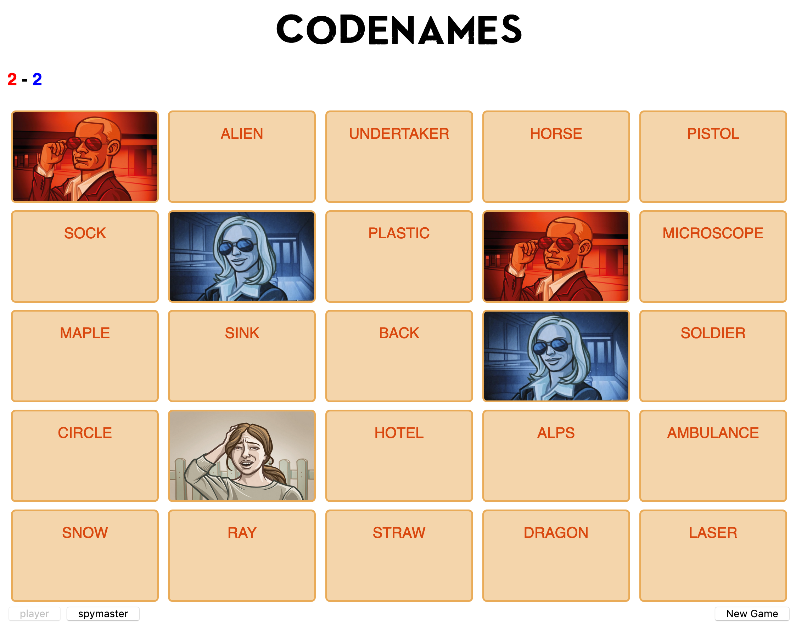

Codenames
=========

The popular boardgame is also an interactive web app!

 ## Rules of the Game

* PDF: [Instructions](https://czechgames.com/files/rules/codenames-rules-en.pdf)
* Video: [How to Play Codenames in 3 Minutes][]

[How to Play Codenames in 3 Minutes]: https://www.youtube.com/watch?v=zQVHkl8oQEU

* * *

<head>

</head>
<body>

 Click me to view an example board!

 
        <header class="">
            <h1>CODENAMES</h1>
            

                

                    <h3>
                        
                         - 
                        
                    </h3>
                

            

        </header>
       

            

                

                    

                        
SNOWMAN

                    

                

                

                    

                        
PALM

                    

                

                

                    

                        
ARM

                    

                

                

                    

                        
AZTEC

                    

                

                

                    

                        
TORCH

                    

                

          

          

                

                    

                        
HOSPITAL

                    

                

                

                    

                        
MOLE

                    

                

                

                    

                        
EMBASSY

                    

                

                

                    

                        
POLICE

                    

                

                

                    

                        
PLOT

                    

                

          

          

                

                    

                        
BELL

                    

                

                

                    

                        
LEAD

                    

                

                

                    

                        
PUPIL

                    

                

                

                    

                        
ICE

                    

                

                

                    

                        
STICK

                    

                

          

          

                

                    

                        
SERVER

                    

                

                

                    

                        
SKYSCRAPER

                    

                

                

                    

                        
TRIANGLE

                    

                

                

                    

                        
MOON

                    

                

                

                    

                        
PRINCESS

                    

                

          

          

                

                    

                        
MUG

                    

                

                

                    

                        
WITCH

                    

                

                

                    

                        
NINJA

                    

                

                

                    

                        
POOL

                    

                

                

                    

                        
PAN

                    

                

          

        
